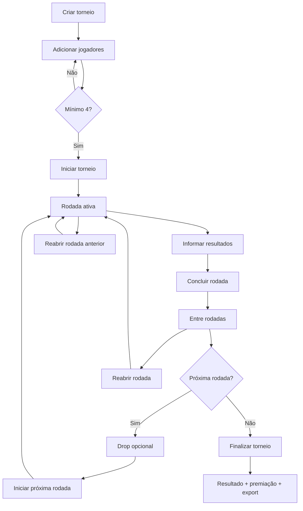

# Manual do operador (mesário)

Guia para quem conduz torneios na loja **sem** conhecimento técnico.

## Fluxo geral

## Premiação

1. Abra **Premiação** no menu.
2. Informe número de jogadores e valor de inscrição (se houver).
3. Escolha o preset (ex.: *Standard*).
4. Use **Calcular** para ver split e créditos na loja.
5. **Exportar CSV** gera arquivo em `exports/` para planilhas.

Se aparecer aviso de exports desatualizados, os presets foram editados — regenere o CSV.

## Torneio — passo a passo

### 1. Criar e preparar

1. **Torneios** → **Novo torneio**.
2. Preencha nome, data, formato (Suíço ou Eliminatória), melhor de, inscrição e preset de premiação.
3. Adicione jogadores (mínimo **4**). Seeds são opcionais.
4. **Iniciar torneio** — confirme se o número de rodadas está adequado.

### 2. Durante cada rodada

1. Na página do torneio, clique **Gerenciar rodada N**.
2. Informe placares de cada mesa (ex.: 2-0, 2-1, 1-0 por tempo, 0-0 empate no Suíço).
3. **Concluir rodada** quando todas as mesas estiverem preenchidas.

> **WO (walkover):** use **Drop na rodada** na mesa — o oponente recebe vitória automática. WO **não** pode ser editado depois.

> **Rematch:** na mesa, o badge **Rematch** indica que os dois jogadores já se enfrentaram em rodada anterior. O pareamento tenta evitar isso (inclusive com **uppair/downpair** entre brackets de pontos); só repete adversário quando não há outra opção.

### 3. Entre rodadas

Após concluir uma rodada:

- Aparece a tela **Entre rodadas**.
- **Drop entre rodadas:** remove jogador sem WO (útil para desistências antes da próxima rodada).
- **Iniciar rodada N+1** quando estiver pronto.
- **Reabrir rodada N:** corrige resultados errados da rodada recém-concluída.

### 4. Corrigir resultados (reabrir rodada)

Use quando digitou placar errado **depois** de concluir a rodada:

| Situação | Ação |
|----------|------|
| Entre rodadas (ainda não iniciou a próxima) | **Reabrir rodada N** na tela Entre rodadas |
| Já iniciou a rodada seguinte | **Reabrir rodada anterior** na página do torneio |

**Importante:** se a rodada seguinte já existia, ela será **removida** e o pairing será **refeito** ao iniciar novamente.

### 5. Finalizar

- Só disponível quando **todas** as rodadas e partidas estão concluídas.
- Calcula premiação automaticamente com base nos jogadores inscritos.
- Acesse **Resultado** para classificação, premiação, decklists e export JSON.

## Regras de placar (resumo)

| Formato | Empate 0-0 | 1-0 / 0-1 (Bo3/Bo5) |
|---------|------------|---------------------|
| Suíço | Permitido | Vitória por tempo |
| Eliminatória | Não | Vitória por tempo |

## Decisões de produto (referência)

- **DROP** na classificação: jogadores que desistiram aparecem no final com label DROP.
- **max_rounds** é fixado ao iniciar (calculado automaticamente se vazio).
- **Export JSON** só após finalizar o torneio.
- **Decklists** opcionais, editáveis após finalizar.

## Checklist rápido na mesa

- [ ] 4+ jogadores antes de iniciar
- [ ] Todos os placares antes de concluir rodada
- [ ] Drops entre rodadas (não durante rodada ativa, exceto WO mid-round)
- [ ] Revisar classificação antes de finalizar
- [ ] Exportar log JSON após finalizar
